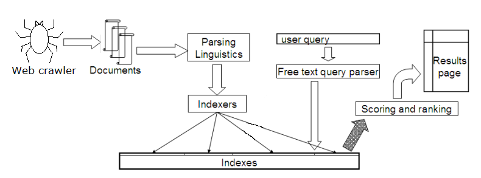

## Technical Report: Search Engine Baseline

## Introduction

This report outlines the implementation of the first version of a search engine, with the goal of building a search engine capable of efficiently searching a restricted set of websites and documents.

## System Architecture

The search engine employs a standard search engine architecture, as illustrated in the diagram below:

The key components of the system are:

1. Crawler: The crawler propagates through the web and uses a First-In-First-Out (FIFO) strategy to process the URLs. It maintains a queue of URLs to visit, initiate the indexing process from unvisited pages and adds new links encountered during crawling to the queue.

2. Tokenizer: The tokenizer retrieves the text from the raw response content format, cleans the retrieved text and braks it down into individual tokens. It currently ignores words that contain Chinese characters or are in the expanded English stopwords list from NLTK. For sentence tokenization, it groups sentences into chunks of 500 characters or less.

3. Indexer: The indexer is responsible for indexing the tokenized content. Two types of indexes are implemented:

    a. Keyword Index: An inverted index that stores the mapping of keywords to the URLs containing them. The keywords are stored in MongoDB, and for each keyword, a list of the URLs that contain it is maintained.

    b. Semantic Index: A semantic index based on a all-MiniLM-L6-v2 model from the Hugging Face Transformers library. It uses the tokens produced by sentence tokenizer described above, semantic vector is calculated for each chunk using the all-MiniLM-L6-v2 model. This semantic index is used to order the search results based on cosine similarity.

Currently every piece of the collected data is automatically loaded into the local storage.

It is quite risky to store everything in a program memory due to several reasons. The first reason is that memory can be not big enough to handle a lot of data that is processed by the search engine. Another reason is when the program crashes, the memory will drop, so we need to store our information in storage to avoid data loss. Also storing everything in the database allows us to make the search engine parallel.

However, storage usage has its own drawbacks, as the efficiency of the indexing and search queries handling decreases, since the usage of a database is slower than direct access from memory.

## Handling queries 

When a user query is received, the search engine follows a two-step approach to retrieve and order the relevant results. 

First, the system performs a keyword-based retrieval, where it looks up the inverted index table in the database to identify the top 100 documents that match the keywords in the user's query. The system calculates a score for each document based on the frequency of the keywords within that document, giving more weight to documents with higher keyword frequency. Specifically, the score for the document is calculated by formula below (where T is query text, and C(KW, D) is a number of keyword entries in the document):

$$\text{Score}(\text{document}) = \sum\limits_{\text{keyword} \in \text{T}} \sum\limits_{k = 1}^{C(KW, D)} \frac{1}{k^4}$$ 

This scoring mechanism gives higher priority to documents that contain the query keywords more frequently and pays attention to the variety of words. Since it's only first version of the search engine I just choose formula that gradually decrease the importance of the keyword entry.

Next, the system takes a semantic vector representation for each of the 100 retrieved document chunks from the semantic index storage. It also calculates a semantic vector for the user's query. The documents are then sorted based on the cosine similarity between the query vector and the document vectors. This semantic ranking ensures that the most relevant documents, based on the overall meaning and context, are presented at the top of the search results. The sorted list of relevant documents is returned as the search results.

This two-step approach, combining keyword-based retrieval and semantic ranking, allows the search engine to identify the relevant documents for the query.

## Challenges and Limitations

The current implementation of the search engine faces a significant challenge in terms of performance. The report mentions that the search engine is very slow, taking around 21.5 hours to process approximately 8,850 documents. This is a critical limitation that needs to be addressed to make the search engine usable.

The specific bottlenecks identified are:

1. Waiting for the response from the internet, as the process of downloading the content from the web is quite slow.
    
2. Working with databases, including reading from and updating the entries in the database.
    
3. The performance limitations of the Python language.

## Improvements and Future Plans

To improve the search engine, the report outlines several key directions. Currently the primary focus will be on the code optimization, with the goal of improving the speed and efficiency of the search engine, since current implementation is too slow. Algorithmic improvements are also being considered, including enhancements to the indexing algorithm and the crawling algorithm. For example, adding prioritization to certain URLs is being explored.

Additionally, I plan to introduce new features, such as implementing a RAG pipeline to generate text answers for user questions. Also it will be good to add the Docker installation and easy deployment to enhance the usability of the system. Also it will be good to create automatic performance evaluation system and tests.