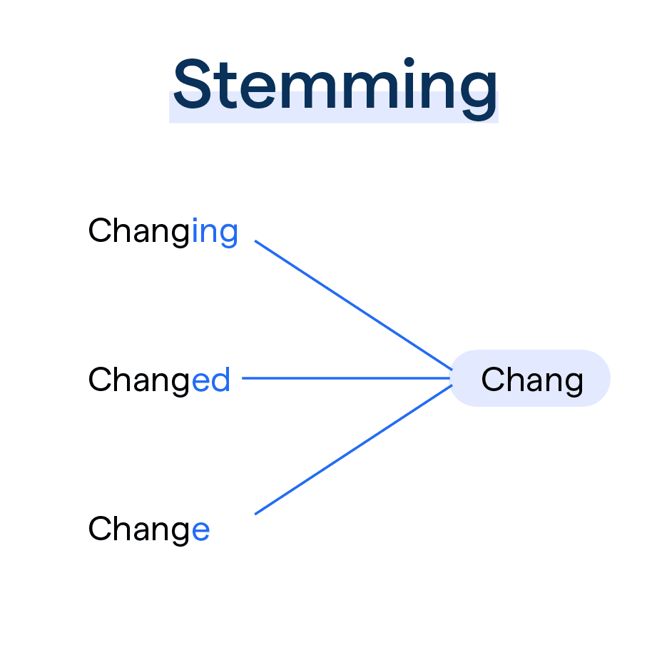

## Technical Report: Search Engine Enhanced Version

## Introduction

This report describes the improvements and changes made to the search engine implementation, with a focus on performance optimization, architecture, and decision reasons.

## System changes

### Crawler

One of the not mentioned challenges  in the technical report was the presence of webpages with broken PDF files or incorrect content. To address this, the search engine now catches all errors from the indexing pipeline and logs the error messages without interrupting the overall crawling process. This prevents the need for manual restarting of the crawling process. Also to improve system performance, the crawler now creates an asynchronous task to index the content of webpages, utilizing the response waiting time to index the webpage content. Since the network speed is typically slower than the indexing speed, this ensures that every webpage will be successfully indexed. However, as a safety measure, if the number of incomplete tasks exceeds a predefined threshold, the crawler enforces task waiting.

### Tokenizers and Indexes

Most of the changes in the tokenization and indexing process are related to improvements in the search algorithm, and mostly changes have been made to the first tokenizer and index pair to maintain an inverted index.

1. The stemming process is now included in the tokenization, to improve the searching algorithm. This was a necessary part for the search engine, because obviously the same words with different endings have the same meaning and must be calculated in the initial score.

  

2. 2-grams and 3-grams (over words) are now also included in the working dictionary. Such a technique allows handling cases where not only the individual words in a phrase are important, but the phrase itself is important. For example, "Data Science" - before, had searches over the individual words "data" and "science", but a webpage could contain something like "Data Analytics ... Life Science", and the information would not be as relevant.

3. The scoring formula has been changed to wf-idf(weighted frequency - inverse document frequence) which is commonly used scoring formula in information retrieval, where N is the total number of documents, $df_t$ the frequency of word $t$ in documents, $d$ is target document:

$$ \text{idf}\_{t} = \log\left(\frac{N}{\text{df}_{t}}\right)$$

$$
\text{wf}\_{d, t} = \begin{cases}
1 + \log\left(\text{tf}\_{d, t}\right) & \text{if tf}\_{d, t} > 0 \\
0 & \text{otherwise}
\end{cases}
$$

$$\text{Score}(\text{d}) = \sum\limits_{\text{t} \in \text{T}} \text{idf}\_{t} \cdot \text{wf}_{d, t}$$

The other changes in indexes and tokenizers are not important, but it necessary to clarify one thing that wasn't described before. Why is a semantic index needed instead of a more classical method? The main reason is that the primary use case of the currently written search engine is to retrieve information from webpages and get the documents for Retrieval-Augmented Generation. The search queries will be much longer than standard queries, so engine needs index that can capture the main semantic meaning and identify useful documents for further work. However, this method has a drawback: the storage usage can be more compressed since a bunch of vectors are stored, and this type of data is not easily compressible.

### Database

The database implementation has been slighlty updated. Previously, an index was not created in the database, and that lead to linear time for search and insert operation, but in the new implementation these operations work in log(|Documents|) time, because creating MongoDB indices that lead to the creation of a balanced binary tree data structure. Storing a balanced binary tree with a small constant factor is likely the best approach for performing such queries. However, the main advantage of such approach (it can perform range queries over oredered data) is not necessary for the current tasks, so using a hash table may be more suitable. But since the other parts of the system are linear, the database queries are not a significant performance concern, except for the is_visited(web page) part, so for now it's not important.

The method of storing the inverted index was changed to store the inverted index as postings rather than as a postings list (inverted list). This is because MongoDB handles queries over postings more efficiently than over postings lists. While it may be possible to achieve similar performance with postings lists, the difference is not expected to be significant. For working with postings, the time complexity is O(log(N) + k), where N is the number of postings and k is the number of documents. In the case of postings lists, the most optimal approach works in O(k) using a hash table. However, since k is usually large enough and the number of queries to the collection per search query is small, this difference can be ignored. Also instead of storing the same URL in the posting list multiple times, pairs of (URL, frequency) are now stored. This makes the scoring process faster, and the changes to the scoring formula allow the score to be calculated using fewer operations with this format.

Also to improve the performance of the system, instead of sending individual queries to the database, queries are now grouped and sent together using MongoDB's "bulk_write" operation.

## Performance

The time usage initially required the search engine to spend 22.5 hours to index 8900 web pages. After optimizing the database, the time was reduced to 4.5 hours for the same number of web pages. Introducing asynchronous pipeline code further reduced the time to 2.25 hours.  Potential improvements could bring the time down to 1-1.5 hour, but further optimization is limited due to network speed. 

Becaues of that the logical question arises, whether rewriting the code is necessary if Python can index all web pages within the total request waiting time, implementation on other languages cannot improve the network speed. But atleast the perfomrance for the search queries also need to be considered, and Python is too slow to handle them fastly, so rewriting the code to C++ could be beneficial.

## Implementation details

The previous report neglected to include implementation details. The implementation is designed to be modular and extensible. Different indexing and tokenization strategies can be easily integrated into system using the abstract Indexer and Tokenizer classes. The indexing pipeline is set up as a callback that gets called for each web page that is crawled and inserted into the database. The crawler itself is implemented asynchronously to make efficient use of request wait times, in other details the core crawler logic is relatively straightforward. The database module currently uses a simple unstructured approach, with separate classes for each required database collection. This may be improved in the future to provide a more structured data model. Overall, the goal has been to make the codebase flexible and easy to extend, while keeping the core implementation as simple and lightweight as possible.

## Future Plans and Challenges

The improved second implementation of the search engine boasts a significant speed boost with a 10x improvement. This enhanced performance is enough for indexing a smaller web space comprising around 500000 pages and conducting searches over it. Current objectives entail constructing an evaluation pipeline to measure search quality and performance, establishing configurations, and crafting a simple README file. All previously proposed ideas and plans are still relevant.

However, several challenges have popped up:

1. Adapting the code to C++. It remains uncertain whether transitioning the MiniLM model usage to C++ code is doable.

2. The code is strongly linked to particular databases, resulting in nearly identical instances of the indexer, crawler, and tokenizer due to their connection to the same databases. How to handle such implementation problem?
